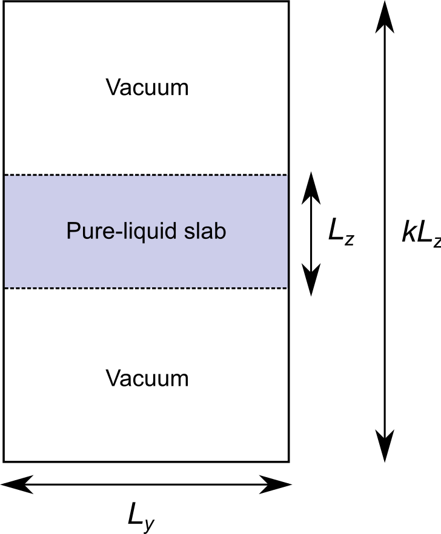

###########
Coordinates
###########

This page describes the implemented routines for constructing initial configurations for the simulations.
These routines are of three types.
The first one involves those that do not require the manipulation of particle positions and thus are program- and file-format-agnostic.
They typically involve using an existing configuration without applying any modifications to it.
The routines of this type provided by ``gmak`` are described in :ref:`overview/coordinates:configuration-recycling routines`.

The second type involves routines that construct a configuration from scratch, starting from the molecular geometries, box dimensions and geometrical constraints.
In this context, ``gmak`` provides a number of routines that rely on GROMACS utilities to create and manipulate configurations.
They encompass the construction of configuration types commonly used in force-field development.
These routines are described in :ref:`overview/coordinates:configuration-construction routines`.

Finally, there are also mixed-type routines, which involve recycling an existing configuration and modifying it to suit a given need.
The single routine of this type provided by ``gmak`` also relies on GROMACS utilities to carry out the configuration manipulation.
It is described in :ref:`overview/coordinates:mixed-type routines`.

Configuration-recycling Routines
================================

Arbitrary Configuration
-----------------------

The arbitrary-configuration routine recycles an existing configuration file.
It is identified with the type ``any`` in the :doc:`input file</usage/input_file>`.
It requires as :py:class:`input parameters<gmak.custom_attributes.CustomizableAttributesMixin.InputParameters>`:

coords
    The path of the recycled configuration file.

.. note::
   The arbitrary-configuration routine should be used for configurations for gas-phase simulations.
   For this reason, it is also provided as the alias type ``gmx_gas``.
   In this case, the recycled configuration should contain a single molecule in vacuum.
   

Protocol-based Configuration
----------------------------

The protocol-based configuration routine recycles the last frame of the production run of a simulation protocol.
For custom protocols, this is the configuration file returned by the function :py:func:`~gmak.api_signatures.get_last_frame`.
For :ref:`GROMACS-based general protocols <overview/protocols:gromacs-compatible general protocol>`, this is the ``.gro`` file written by ``mdrun`` at the end of the production run.
This routine is identified with the type ``follow`` in the :doc:`input file</usage/input_file>`.
It requires as :py:class:`input parameters<gmak.custom_attributes.CustomizableAttributesMixin.InputParameters>`:

follow
    The name of the protocol from which the recycled configuration is retrieved.

Configuration-construction Routines
===================================

Pure-liquid Configuration
-------------------------

The pure-liquid configuration routine constructs a configuration containing a given number of copies of a molecule within a box with some given dimensions.
It is identified with the type ``gmx_liquid`` in the :doc:`input file</usage/input_file>`.
It requires as :py:class:`input parameters<gmak.custom_attributes.CustomizableAttributesMixin.InputParameters>`:

coords
    The path of a configuration file containing a single copy of the
    desired molecule.

nmols
    The desired number of molecules.

box
    The desired box dimensions. Only rectangular boxes are supported.
    This is either a triple of numbers specifying the box-edge lengths
    of a rectangular box or a single number specifying the box-edge
    lenghts of a cubic box.

It relies on the ``gmx`` programs:

``insert-molecules``
    To construct the configuration based on the data supplied as
    input parameters.

Solute-in-solvent Configuration
-------------------------------

The solute-in-solvent configuration routine constructs a configuration contanining given numbers of copies of two molecules (a solute and a solvent) within a box with some given dimensions.
It is identified with the type ``gmx_solvation`` in the :doc:`input file</usage/input_file>`.
It requires as :py:class:`input parameters<gmak.custom_attributes.CustomizableAttributesMixin.InputParameters>`:

coords
    A pair of configuration-file paths.
    The first configuration should contain a single copy of the solute molecule.
    The second configuration should contain a single copy of the solvent molecule.

nmols
    A pair of integers specifying the desired number of solute and
    solvent molecules, respectively.

box
    The desired box dimensions. Only rectangular boxes are supported.
    This is either a triple of numbers specifying the box-edge lengths
    of a rectangular box or a single number specifying the box-edge
    lenghts of a cubic box.

It relies on the ``gmx`` programs:

``insert-molecules``
    To create a temporary pure-liquid configuration containing the
    solvent molecules and also to subsequently insert the solute
    molecules in it, yielding the final configuration.

Slab Configuration
------------------

The slab-configuration routine constructs a configuration containing a rectangular pure-liquid slab of given dimensions within a larger rectangular box.
The simulation-box dimensions are the same as those for the slab, except for one axis which is extended by a given factor, thereby creating two liquid-vacuum interfaces
(see :numref:`Fig. {number} <slabfig>`).
It is identified with the type ``gmx_slab`` in the :doc:`input file</usage/input_file>`.

.. _slabfig:

   Example of a slab configuration where the :math:`z` axis of the
   slab has been extended by a factor of :math:`k` to construct the
   simulation box. The figure represents only the :math:`yz` plane.

It is based on the :py:class:`input parameters<gmak.custom_attributes.CustomizableAttributesMixin.InputParameters>`:

coords
    The path of a configuration file containing a single copy of the
    desired molecule.

nmols
    The desired number of molecules.

box
    The dimensions of the pure-liquid slab (e.g., :math:`L_x`,
    :math:`L_y` and :math:`L_z` in :numref:`Fig. {number} <slabfig>`).
    Only rectangular boxes are supported.  This is either a triple of
    numbers specifying the box-edge lengths of a rectangular box or a
    single number specifying the box-edge lenghts of a cubic box.

axis
    (optional, default is ``z``) The axis extended in preparing the
    simulation box (e.g., *z* in :numref:`Fig. {number} <slabfig>`).
    Possible values are ``x``, ``y`` or ``z``.

factor
    (optional, default is ``5.0``) The factor by which the length of
    the extended axis is multiplied (e.g., *k* in :numref:`Fig.
    {number} <slabfig>`).

It relies on the ``gmx`` programs:

``insert-molecules``
    To create a temporary pure-liquid configuration with the
    slab dimensions.

``trjconv``
    To create a second temporary pure-liquid configuration where it is
    guaranteed that no molecules are broken across the box boundaries
    (option ``-pbc whole``).

``editconf``
    To modify the length of the extended axis.

Mixed-type Routines
===================

Slab-from-Liquid Configuration
------------------------------

The slab-from-liquid configuration routine constructs a slab configuration as in :ref:`overview/coordinates:slab configuration`, but starting from a pure-liquid configuration recycled from a simulation protocol, as in :ref:`overview/coordinates:protocol-based configuration`.
It is identified with the type ``gmx_slab_follow`` in the :doc:`input file</usage/input_file>`.
It is based on the :py:class:`input parameters<gmak.custom_attributes.CustomizableAttributesMixin.InputParameters>`:

follow
    The name of the protocol from which the recycled pure-liquid configuration is retrieved.

axis
    (optional, default is ``z``) The axis extended in preparing the
    simulation box (e.g., *z* in :numref:`Fig. {number} <slabfig>`).
    Possible values are ``x``, ``y`` or ``z``.

factor
    (optional, default is ``5.0``) The factor by which the length of
    the extended axis is multiplied (e.g., *k* in :numref:`Fig.
    {number} <slabfig>`).

It relies on the ``gmx`` programs:

``trjconv``
    To fix any possible molecules that are broken across the box
    boundaries in the recycled pure-liquid configuration (option
    ``-pbc whole``).

``editconf``
    To modify the length of the extended axis.

